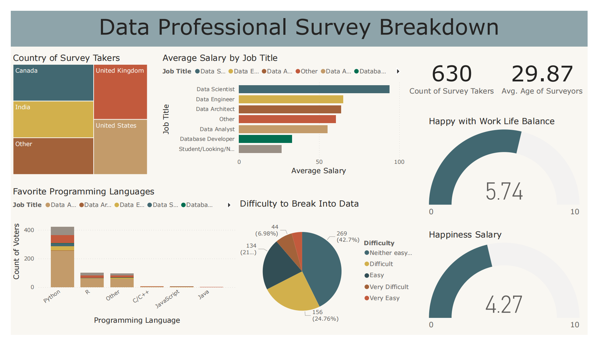

# 📊 Data Professional Survey Analysis (Power BI)

## 📌 Project Overview

This project analyzes a global survey of data professionals to understand:

* Salary differences by job title
* Programming language preferences
* Work-life balance satisfaction
* Salary satisfaction
* Difficulty entering the data field
* Demographics of respondents

The goal is to extract insights useful for aspiring data professionals and recruiters.

---

## 🖼 Dashboard Preview

---

## 🛠 Tools Used

* Power BI
* Power Query (Data Cleaning)
* DAX (Measures & Calculations)

---

## 📈 Key Insights

* Data Scientists have the highest average salary among respondents
* Python is the most preferred programming language
* Many respondents report moderate difficulty entering the data field
* Work-life balance satisfaction is higher than salary satisfaction

---

## 📂 Dataset

Survey dataset of data professionals (cleaned using Power Query).

---

## 🚀 How to Use

1. Download the `.pbix` file
2. Open using Power BI Desktop
3. Interact with the dashboard filters

---

## 👤 Author

Bayu Chandra Putra | Data Analyst
